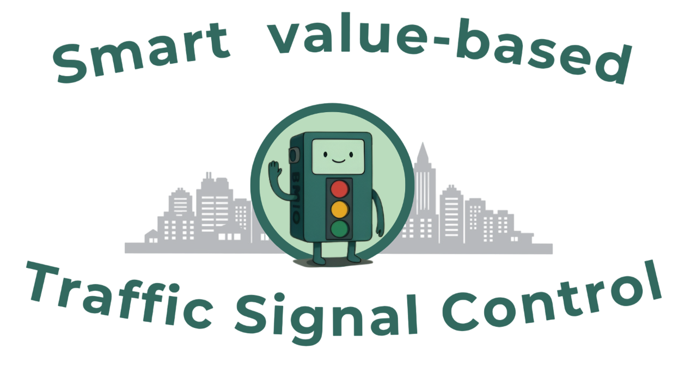
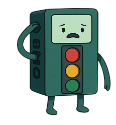

<p align="center">
  
</p>

# 🧠 What is it?

A traffic control scheme development system that enables the design of **value-based intelligent traffic lights** through reinforcement learning, evaluating their performance in a simulated urban traffic environment.

---

## 📝 Summary

In the face of global urban congestion, **intelligent traffic lights** are emerging as a key tool, combining real-time data processing with autonomous decision-making to reduce traffic jams and waiting times.

The analysis of adaptive traffic control systems is a growing field, with **reinforcement learning** techniques standing out. This paradigm enables traffic light agents to autonomously discover optimal policies through continuous interaction with the road environment, guided by reward signals that assess their behavior.

The flexibility in reward design allows the incorporation of **social values** beyond traditional efficiency goals, such as **sustainability**, **safety**, or **equity**. This leads to the concept of **value-based intelligent traffic lights**—systems explicitly guided by social considerations, selectively prioritizing values depending on specific urban needs.

This project addresses the challenge of designing and implementing value-based traffic control systems through a comprehensive approach:  
1. Developing an integrated environment using the SUMO simulator for training and evaluation.  
2. Implementing a multi-agent reinforcement learning algorithm with specialized reward signals to generate a **catalog of control schemes** aligned with different social values.  
3. Performing a rigorous comparative evaluation against traditional systems (fixed-time and heuristic-based adaptive models).

---

### 🎯 Project Goals

- Build an integrated environment (SUMO + Gymnasium) to simulate and compare traffic light control policies based on **efficiency**, **sustainability**, and **modal equity**.
- Evaluate from classic models (**fixed-time**), through **heuristic rule-based systems**, to advanced **deep reinforcement learning agents**.
- Generate a catalog of RL agents with **differentiated value profiles** depending on the reward design.

---

## ⚙️ Technologies Used

- **Python 3.10+**
- [**SUMO**](https://www.eclipse.org/sumo/) – Traffic simulation engine
- [**Gymnasium**](https://gymnasium.farama.org/) – Customizable RL environment
- **PyTorch** – Neural network training

---

## 🗂️ Repository Structure

```plaintext
📁 /agents           → Implementations of various agent types (fixed-time, heuristic, learning-based)
📁 /models           → Trained models with different value profiles
📁 /plots            → Plots generated from the trained models
📁 /simulation       → Simulation files used in experiments: `.net`, `.rou`, `.sumoconfig`
📄 createRoutes.py   → Script to create random vehicle flows from a traffic network
📄 graphics.txt      → Script to generate training-related plots
📄 SUMOextractor.py  → Methods for extracting info from `.net` traffic network files
📄 TrafficEnvironment.py → Gymnasium environment implementation for agent interaction
📄 train.py          → Agent training script
📄 test.py           → Agent evaluation using value-based metrics
```
---


## ❓ How to use the system? 

### 1️⃣ Set up SUMO
- Download SUMO from: [https://www.eclipse.org/sumo/](https://www.eclipse.org/sumo/)
- Create an environment variable `SUMO_HOME` pointing to your SUMO installation root folder.  
  Alternatively, you can directly set the path in the scripts (`train.py`, `test.py`, and `SUMOextractor.py`).

### 2️⃣ Set up the Python environment
- Make sure Python 3.10+ is installed.
- Use a code editor (like VSCode or PyCharm).
- Install dependencies with:
  ```bash
  `pip install -r requirements.txt`.
  ```

  ### 3️⃣ Create or use a traffic simulation
- To design your own network, open **NetEdit** (included with SUMO) and build your map to your liking.  
> ⚠️ Note: This project assumes roads with 4-lane intersections in both directions. If you use different topologies, you may need to modify the `SUMOextractor.py` script or even the environment itself if observations or actions change.

- To use the network from the experiments, copy the files from the `simulation/` folder and paste them into your SUMO directory (your `SUMO_HOME` path).

### 4️⃣ Run and test
You can either:
#### 🅰️ Use the existing model catalog

Includes policies oriented toward different social values:
- **Efficiency** (reduces delay times)
- **Modal equity** (prioritizes public transport)
- **Sustainability – climate** (reduces fuel consumption and CO₂ emissions)
- **Sustainability – air quality** (reduces NOx emissions)

**Steps:**

A1. **Choose a model to test**  
  - Select one of the pre-trained models available in the catalog.

A2. **Run the `test.py` script**
- You can adjust the number of episodes or enable/disable the GUI by changing the `-gui` option in the `sumo_cmd`.

A3. **Observe the simulation**  
- The SUMO GUI will launch, and you’ll see the simulation in action. Once it's done, performance metrics will be displayed.

#### 🅱️ Create your own agents

B1. **Define your new agent type**  
- Create a new class in the `agents/` folder. Inherit from `LearningAgent` if it’s a learning agent, or from `BaseAgent` otherwise.

B2. **Implement required methods**  
- Implement the `act` method, and if your agent learns during training, also implement `act_and_train`.

B3. **Customize the reward signal**  
- Modify the `get_reward` method inside `TrafficEnvironment.py` to define how your agent receives feedback from the environment.

B4. **Integrate the agent into the training script**  
- In `train.py`, update the `train()` function to include your new agent type and assign it a name.

B5. **Run the training**
- Run the training, specifying the name under which the model will be saved, and optionally, the number of episodes to run. If not specified, early stopping will be used.

B6. **Analyze the results**  
- After training, learning curves and performance metrics will be generated. Your model will be saved and ready for testing.

B7. **Test your model**  
- Return to option 🅰️ and follow the steps to test your custom-trained agent.

